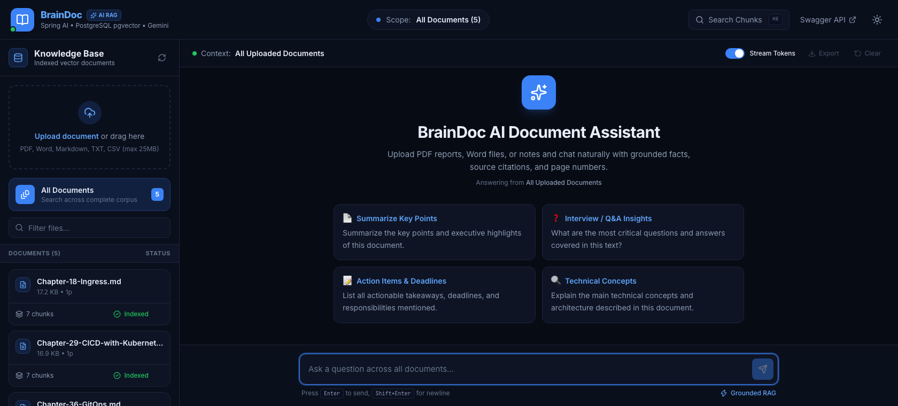
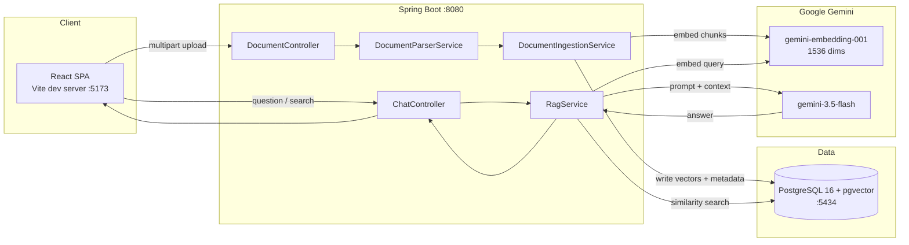
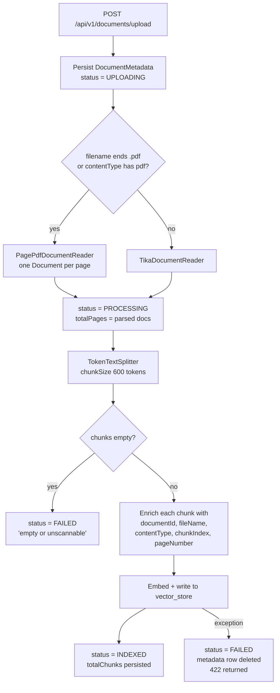
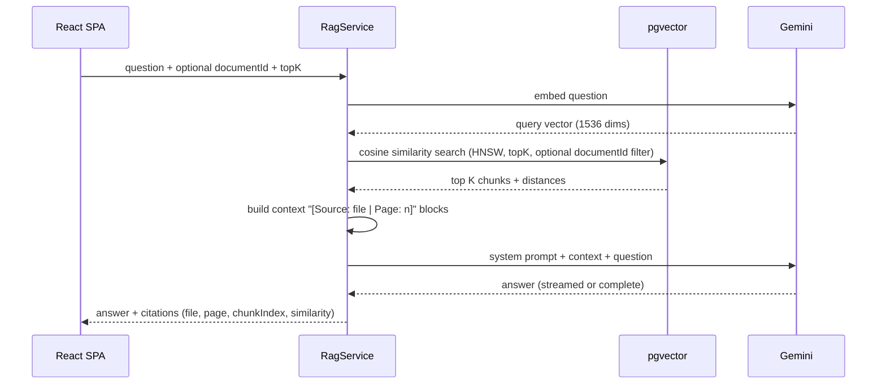

# BrainDoc

Retrieval-augmented document intelligence. Upload PDFs, Word files, Markdown or CSVs; BrainDoc parses
them, splits them into chunks, embeds each chunk into PostgreSQL `pgvector`, and answers questions
grounded in the retrieved passages — with citations back to the source file, page and chunk.

[](https://openjdk.org/projects/jdk/21/)
[](https://spring.io/projects/spring-boot)
[](https://docs.spring.io/spring-ai/reference/)
[](https://react.dev)
[](https://vite.dev)
[](https://tailwindcss.com)
[](https://github.com/pgvector/pgvector)



---

## Contents

- [What it does](#what-it-does)
- [Architecture](#architecture)
- [How retrieval works](#how-retrieval-works)
- [Tech stack](#tech-stack)
- [Repository structure](#repository-structure)
- [Prerequisites](#prerequisites)
- [Quick start](#quick-start)
- [Configuration](#configuration)
- [API reference](#api-reference)
- [Frontend components](#frontend-components)
- [Troubleshooting](#troubleshooting)
- [Author](#author)

---

## What it does

| Capability | Detail |
| --- | --- |
| **Multi-format ingestion** | PDF via `PagePdfDocumentReader` (page-aware); everything else via Apache Tika — Word, Markdown, TXT, CSV, HTML, PPTX, XLSX |
| **Single and batch upload** | One request per file with a live progress bar, or a batch endpoint |
| **Grounded chat** | Answers cite the file, page number, chunk index and cosine similarity of every passage used |
| **Token streaming** | Answers stream token-by-token, or arrive in one response with citations attached |
| **Corpus or document scope** | Query the whole knowledge base, or restrict retrieval to a single document |
| **Semantic chunk search** | Query the vector store directly to inspect which chunks match a concept, with no LLM call |
| **Prompt templates** | Four starter prompts for summarising, Q&A extraction, action items and technical concepts |
| **Document inspection** | Size, page count, chunk count, indexing status and a sample of the stored vector chunks |
| **Lifecycle management** | Deleting a document also purges its embeddings from `pgvector` |

---

## Architecture

Two deployable parts and one database. The frontend never talks to Gemini directly; all model access
is server-side.



### Ingestion flow

A file becomes searchable through a single synchronous request. Status is persisted at each step, so a
failure is visible in the document list rather than silent.



### Query flow



---

## How retrieval works

**Chunking.** `TokenTextSplitter` splits parsed text at a target of **600 tokens** per chunk, with a
minimum of 350 characters before a split is considered, a 5-character floor below which a chunk is not
embedded, and a ceiling of 10,000 chunks per document. Separators are preserved.

**Metadata enrichment.** Every chunk carries `documentId`, `fileName`, `contentType`, `chunkIndex` and,
where the reader supplied one, `pageNumber`. `documentId` is what makes single-document scoping and
cascading deletes possible.

**Embedding.** Chunks are embedded with `gemini-embedding-001` at **1536 dimensions** using task type
`RETRIEVAL_DOCUMENT`. The dimension is deliberate: Gemini defaults to 3072, but `pgvector`'s HNSW index
caps at 2000, and 1536 scores equivalently on MTEB thanks to Matryoshka truncation.

**Storage.** Vectors live in the `vector_store` table with an **HNSW** index under **cosine distance**.
The schema is created automatically on first start.

**Retrieval.** `RagService.retrieveRelevantDocuments` resolves an effective `topK` (request value, else
`app.rag.top-k` = 5) and an effective threshold (request value, else `app.rag.similarity-threshold` =
0.0). A threshold is only applied when greater than zero, so the default returns the nearest K chunks
unfiltered. When `documentId` is present, a `FilterExpressionBuilder` equality filter restricts the
search to that document.

**Prompting.** Retrieved chunks are joined into `[Source: <file> | Page: <n>]` blocks separated by
`---`. That context, the question, and a system prompt defining the assistant's behaviour are sent to
`gemini-3.5-flash` (temperature 0.2). When no chunk matches, a second prompt variant is used that asks
the model to answer conversationally from general knowledge instead of pretending to have context.

**Citations.** Each retrieved chunk maps to a citation with `documentId`, `fileName`, `chunkIndex`,
`pageNumber`, the chunk text, and a similarity score computed as `1.0 - distance`.

> **Note on chat models.** Chat uses Gemini's OpenAI-compatible endpoint, which is spec-compliant.
> Embeddings must use the native Google GenAI client instead: Gemini's OpenAI-compatible `/embeddings`
> omits the `index` and `usage` fields that the official OpenAI Java SDK requires. This is why
> `spring.ai.model.embedding` is set to `none` — it disables the OpenAI embedding bean so the native
> one supplies it.

---

## Tech stack

### Backend

| Component | Choice |
| --- | --- |
| Language / runtime | Java 21 |
| Framework | Spring Boot 4.1.0 (`spring-boot-starter-webmvc`, `-data-jpa`, `-validation`) |
| AI orchestration | Spring AI 2.0.0 |
| Chat model | `gemini-3.5-flash` via Gemini's OpenAI-compatible endpoint |
| Embedding model | `gemini-embedding-001`, 1536 dimensions, native Google GenAI starter |
| Vector store | `spring-ai-starter-vector-store-pgvector` |
| Document parsing | `spring-ai-pdf-document-reader`, `spring-ai-tika-document-reader` |
| Mapping | ModelMapper 3.2.4 |
| API docs | springdoc-openapi 3.1.0 |
| Boilerplate | Lombok |

### Frontend

| Component | Choice |
| --- | --- |
| UI | React 19.2 + TypeScript 5.9 |
| Build | Vite 8.2 |
| Styling | Tailwind CSS 4.3 (`@tailwindcss/vite`, CSS-variable theming) |
| Server state | TanStack Query 5 |
| Client state | Zustand 5 (persisted to `localStorage`) |
| Markdown | react-markdown 10 + remark-gfm |
| Icons / toasts | lucide-react, sonner |

### Infrastructure

| Component | Choice |
| --- | --- |
| Database | `pgvector/pgvector:pg16` via Docker Compose |
| Extensions | `vector`, `uuid-ossp` (created by `init.sql`) |
| Host port | `5434` (mapped to container `5432`) |

---

## Repository structure

```
DocAI/
├── docs/
│   └── screenshot.png
├── DocAiBackend/                        Spring Boot REST API
│   ├── docker-compose.yml               pgvector/pg16 service
│   ├── init.sql                         creates the vector + uuid-ossp extensions
│   ├── pom.xml
│   └── src/main/
│       ├── java/com/vikas/docai/
│       │   ├── config/
│       │   │   ├── ApiKeyValidator.java     fails loudly at startup if no Gemini key resolved
│       │   │   ├── AppProperties.java       binds app.rag.* and app.cors.*
│       │   │   ├── CorsConfig.java
│       │   │   └── ProjectConfig.java       ChatClient system prompt, OpenAPI info, ModelMapper
│       │   ├── controller/
│       │   │   ├── ChatController.java      /api/v1/chat/**
│       │   │   └── DocumentController.java  /api/v1/documents/**
│       │   ├── dto/                         ApiResponse envelope + request/response DTOs
│       │   ├── entity/                      DocumentMetadata, DocumentStatus
│       │   ├── exception/                   GlobalExceptionHandler + domain exceptions
│       │   ├── repository/                  DocumentMetadataRepo
│       │   └── service/
│       │       ├── DocumentParserService.java     PDF vs Tika routing
│       │       ├── DocumentIngestionService.java  split, enrich, embed, persist status
│       │       ├── DocumentMetadataService.java   upload orchestration, list, delete
│       │       └── RagService.java                retrieval, prompting, citations
│       └── resources/
│           ├── application.yml           profile, .env import, server port, springdoc filter
│           └── application-dev.yml       datasource, Gemini, pgvector, multipart, app.rag
└── DocAiFrontend/
    ├── screenshots/                     UI reference images
    └── frontend/                        React single-page app
        ├── index.html                   pre-paint theme script
        ├── vite.config.ts               dev proxy to the backend
        └── src/
            ├── api/                     one module per backend controller
            ├── components/
            │   ├── chat/                composer, messages, markdown, citations, templates
            │   ├── documents/           dropzone, cards, upload dialog, detail dialog
            │   ├── layout/              header, sidebar
            │   ├── search/              semantic search dialog
            │   └── ui/                  button, modal, progress bar, toggle, badges
            ├── hooks/                   queries, chat controller, upload queue, theme, hotkeys
            ├── lib/                     fetch wrapper, formatters, constants
            ├── store/                   Zustand stores
            └── types/api.ts             mirrors the backend DTOs field for field
```

---

## Prerequisites

| Tool | Version used | Notes |
| --- | --- | --- |
| JDK | 21 | Maven wrapper included, no local Maven needed |
| Node.js | 22 or newer (developed on 26.7) | |
| npm | 10 or newer (developed on 11.19) | |
| Docker | 29.x | For the pgvector container |
| Gemini API key | — | From [Google AI Studio](https://aistudio.google.com/apikey) |

---

## Quick start

### 1. Database

```bash
cd DocAiBackend
docker compose up -d
```

Postgres 16 with `pgvector` starts on host port **5434**. `init.sql` creates the `vector` and
`uuid-ossp` extensions on first boot. The application creates the `vector_store` table and the JPA
schema itself on startup.

### 2. Backend

Create `DocAiBackend/.env` (gitignored) with your key:

```properties
GEMINI_API_KEY=your-key-here
```

Then start the API **from the `DocAiBackend` directory**:

```bash
cd DocAiBackend
./mvnw spring-boot:run
```

Confirm this line appears in the log:

```
com.vikas.docai.config.ApiKeyValidator : Gemini API key resolved for chat and embeddings.
```

If it instead prints a `GEMINI API KEY NOT RESOLVED` banner, follow the instructions in that banner —
every chat and search request will fail until it is fixed.

- API: <http://localhost:8080>
- Swagger UI: <http://localhost:8080/swagger-ui/index.html>

### 3. Frontend

```bash
cd DocAiFrontend/frontend
npm install
npm run dev
```

Open <http://localhost:5173>. No frontend configuration is required: Vite proxies `/api` to
`http://localhost:8080`, so the browser sees a same-origin application.

| Script | Purpose |
| --- | --- |
| `npm run dev` | Dev server with hot module replacement |
| `npm run build` | Production bundle into `dist/` |
| `npm run typecheck` | `tsc` project references, no emit |
| `npm run preview` | Serve the built bundle |

---

## Configuration

### Backend

Read from `DocAiBackend/.env` or the process environment. The `.env` import is `optional:`, so a
missing file does not stop startup — `ApiKeyValidator` reports it instead.

| Variable | Default | Purpose |
| --- | --- | --- |
| `GEMINI_API_KEY` | `demo-key` | Used for both chat and embeddings |
| `GEMINI_CHAT_MODEL` | `gemini-3.5-flash` | Chat model |
| `GEMINI_EMBEDDING_MODEL` | `gemini-embedding-001` | Embedding model |
| `GEMINI_EMBEDDING_DIMENSIONS` | `1536` | Must match the `pgvector` column dimension |
| `GEMINI_REASONING_EFFORT` | `none` | Gemini 3.x reasons by default; `none` cuts latency substantially |
| `AI_BASE_URL` | `https://generativelanguage.googleapis.com/v1beta/openai` | OpenAI-compatible chat endpoint |
| `DB_HOST` / `DB_PORT` | `localhost` / `5434` | Matches the Compose port mapping |
| `DB_NAME` / `DB_USERNAME` / `DB_PASSWORD` | `docai` / `postgres` / `postgres` | |

Tunable in `application-dev.yml`:

| Key | Default | Purpose |
| --- | --- | --- |
| `app.rag.chunk-size` | `600` | Target tokens per chunk |
| `app.rag.top-k` | `5` | Chunks retrieved per query |
| `app.rag.similarity-threshold` | `0.0` | Only applied when greater than zero |
| `spring.servlet.multipart.max-file-size` | `25MB` | Per-file upload limit |
| `spring.servlet.multipart.max-request-size` | `50MB` | Total request limit |
| `springdoc.paths-to-match` | `/api/v1/**` | Keeps third-party starters out of the API docs |

### Frontend

Copy `.env.example` to `.env` only if the backend is not on `http://localhost:8080`.

| Variable | Default | Purpose |
| --- | --- | --- |
| `VITE_BACKEND_ORIGIN` | `http://localhost:8080` | Dev proxy target and Swagger link |
| `VITE_API_BASE_URL` | *(empty)* | Absolute API origin. Leave empty in development so the proxy handles it |

---

## API reference

All JSON responses share one envelope:

```json
{
  "success": true,
  "message": "All documents is here",
  "data": {},
  "timestamp": "2026-09-08T18:04:20.006634"
}
```

### Documents

| Method | Path | Request | Response `data` |
| --- | --- | --- | --- |
| `POST` | `/api/v1/documents/upload` | multipart, part `file` | `DocumentResponseDto` (201) |
| `POST` | `/api/v1/documents/upload-multiple` | multipart, repeated part `files` | `DocumentResponseDto[]` (201) |
| `GET` | `/api/v1/documents` | — | `DocumentMetadataDto[]`, newest first |
| `GET` | `/api/v1/documents/{id}` | — | `DocumentMetadataDto` |
| `DELETE` | `/api/v1/documents/{id}` | — | `null`; also purges the document's vectors |

### Chat

| Method | Path | Request | Response `data` |
| --- | --- | --- | --- |
| `POST` | `/api/v1/chat/query` | `ChatRequestDto` | `ChatResponseDto` with citations |
| `POST` | `/api/v1/chat/stream` | `ChatRequestDto` | Raw token stream, **not** the envelope |
| `POST` | `/api/v1/chat/search/similarity` | `SearchRequestDto` | `SearchResultDto` |

### Payloads

| DTO | Fields |
| --- | --- |
| `ChatRequestDto` | `question` (required), `documentId`, `topK`, `minSimilarity`, `conversationId` |
| `ChatResponseDto` | `answer`, `conversationId`, `citations[]`, `responseTimeMs` |
| `SearchRequestDto` | `query` (required), `documentId`, `topK`, `similaritySearch` |
| `SearchResultDto` | `query`, `totalMatches`, `matches[]` |
| `CitationDto` | `documentId`, `fileName`, `chunkIndex`, `pageNumber`, `snippet`, `similarityScore`, `metadata` |
| `DocumentMetadataDto` | `id`, `filename`, `contentType`, `fileSize`, `totalPages`, `totalChunks`, `status`, `errorMessage`, `createdAt`, `updatedAt` |
| `DocumentResponseDto` | `id`, `fileName`, `fileSize`, `status`, `chunksCreated`, `message` |

`DocumentStatus` is one of `UPLOADING`, `PROCESSING`, `INDEXED`, `FAILED`.

> **Field naming.** Document metadata uses `filename` (lower-case `n`); the upload response uses
> `fileName`. This is a genuine inconsistency in the DTOs, and the frontend types mirror it exactly.

### Example

```bash
curl -X POST http://localhost:8080/api/v1/chat/search/similarity \
  -H 'Content-Type: application/json' \
  -d '{"query":"ingress controller","topK":3}'
```

```json
{
  "success": true,
  "message": null,
  "data": {
    "query": "ingress controller",
    "totalMatches": 1,
    "matches": [
      {
        "documentId": "29f4691f-6cda-445d-a98b-5111e16e409b",
        "fileName": "runbook.md",
        "chunkIndex": 0,
        "pageNumber": null,
        "snippet": "A Kubernetes Ingress exposes HTTP routes...",
        "similarityScore": 0.71
      }
    ]
  },
  "timestamp": "2026-09-08T18:16:36.782755"
}
```

### Error status codes

| Exception | Status |
| --- | --- |
| `ResourceNotFoundException` | `404 Not Found` |
| `DocumentProcessingException` | `422 Unprocessable Content` |
| `MaxUploadSizeExceededException` | `422 Unprocessable Content` |
| `MethodArgumentNotValidException` | `400` with field errors in `data` |
| Any other exception | `400 Bad Request` |

---

## Frontend components

| Area | Component | Responsibility |
| --- | --- | --- |
| Layout | `AppHeader` | Brand, retrieval scope pill, search shortcut, Swagger link, theme toggle |
| Layout | `Sidebar` | Knowledge base: dropzone, corpus scope, filter, document list |
| Documents | `UploadDropzone` / `UploadDialog` | Drag-and-drop and per-file progress with cancel and retry |
| Documents | `DocumentCard` | Filename, size, pages, chunk count, indexing status |
| Documents | `DocumentDetailModal` | Statistics plus a sample of the stored vector chunks |
| Chat | `ChatPanel` | Context bar, transcript, streaming toggle, export, clear |
| Chat | `MessageBubble` / `Citations` | Markdown answers with expandable sources |
| Chat | `Composer` | Auto-growing input, Enter to send, stop generation |
| Chat | `WelcomeScreen` | The four prompt templates |
| Search | `SearchModal` | Semantic chunk search with highlighted query terms |

State is split deliberately: **TanStack Query** owns server state (document list, chunk samples,
mutations with cache invalidation), while **Zustand** owns client state (theme, scope, per-scope chat
threads, upload queue), persisted to `localStorage`.

Two implementation notes worth knowing:

- **Uploads are one request per file.** `/upload-multiple` exists, but a single batched request can
  only report one aggregate progress value. Per-file requests give every row its own bar, status and
  error message; the server loops over a batch sequentially anyway.
- **Streaming requests `text/plain`.** `ChatController.streamQuestion` returns `Flux<String>`, and
  Spring MVC selects its rendering by content negotiation. Requesting `text/event-stream` would wrap
  each token in an SSE frame, whose framing mangles the newlines that Markdown answers depend on.
  Requesting `text/plain` takes the `ResponseBodyEmitter` path and preserves the raw token stream.

---

## Troubleshooting

| Symptom | Cause and fix |
| --- | --- |
| `400 "Please pass a valid API key"` on every chat request | `GEMINI_API_KEY` was not resolved. The `.env` import is relative to the JVM working directory, so launching from the repository root instead of `DocAiBackend` misses it. Start with `cd DocAiBackend && ./mvnw spring-boot:run`, or export the variable. `ApiKeyValidator` prints the exact cause at startup |
| Chat returns `500` with an empty body | The exception was thrown inside the streaming `Flux` after the response committed, so `GlobalExceptionHandler` never sees it. Turn **Stream Tokens** off in the UI to route the same question through `/chat/query`, which returns a readable JSON error |
| Search returns `totalMatches: 0` although documents show as `INDEXED` | `RagService` catches retrieval failures and returns an empty list, so an embedding error looks like "no matches". Check the backend log, and confirm the key resolved at startup |
| Upload fails with `422` | Parsing or embedding failed. The response message carries the reason; the metadata row is rolled back so no orphan appears in the list |
| Frontend shows "Backend unreachable" | The API is not running on `http://localhost:8080`, or `VITE_BACKEND_ORIGIN` points elsewhere |
| Port `5434` already in use | Another Postgres instance is bound. Change the host side of the Compose port mapping and set `DB_PORT` to match |
| A real 404 arrives as `400` | `GlobalExceptionHandler.handleGeneric` maps every unhandled exception to `BAD_REQUEST`. Add a `NoResourceFoundException` handler if you need accurate 404s |

---

## Author

Built by [**Vickycoder123**](https://github.com/Vickycoder123).
Repository: <https://github.com/Vickycoder123/BrainDocAI>
